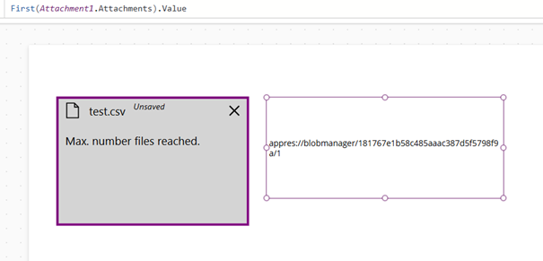
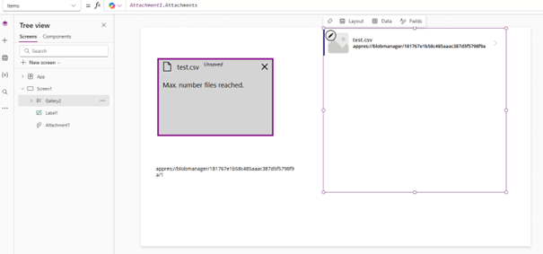
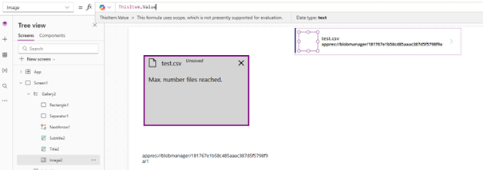
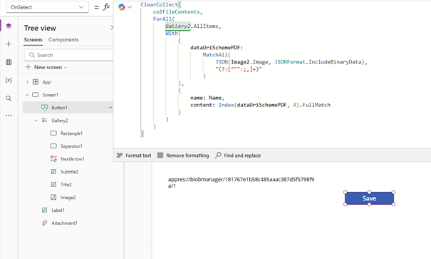
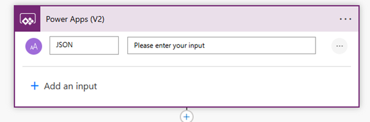
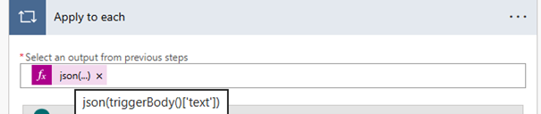
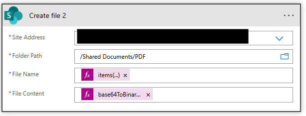
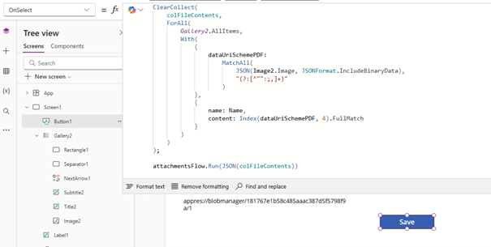
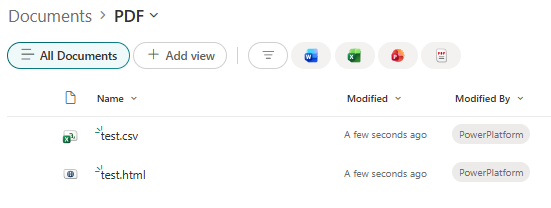

## Problem description

If you've ever tried to add an attachment control in Power Apps and save the uploaded file to SharePoint using Power Automate, you've probably run into a frustrating problem. When a user selects a file, its value is temporarily stored in an internal Power Apps format  as a link starting with `appres://blobmanager/...`. It seems harmless enough, until you actually try to send that file somewhere.
The problem is that Power Automate cannot "fetch" a file from such an address. It is purely an internal temporary identifier that Power Automate has serious trouble interpreting. As a result, the flow either throws an error or an empty and corrupted file ends up on SharePoint.


## Solution

### Step 1. Adding an Attachment Control Without a Form
In Power Apps, you don't need to use a Form component to use the attachment control. Simply copy the YAML code below and paste it into the screen tree. The control will be added automatically.
yaml
```text
Attachment1:
  Control: Attachments
  Properties:
    BorderColor: =Color.Purple
    BorderThickness: =5
    Fill: =RGBA(169,169,169,.5)
    Height: =268
    MaxAttachments: =1
    Size: =18
    Width: =402
    X: =60
    Y: =111
```
________________________________________
### Step 2. Adding an Attachment and the Value issue
Once the control is added and the user selects a file, we can inspect the value of the first attachment using the formula:

```text
First(Attachment1.Attachments).Value
```
As you can see in the screenshot below, the returned value takes the format appres://blobmanager/... This is an internal temporary address used by Power Apps that cannot be directly passed to Power Automate to save the file to SharePoint.

 
________________________________________
 ### Step 3. Creating a Gallery for File Conversion
To extract the file data in Base64 format, we need to use a gallery. Add a Gallery component to the screen, then in its Items property enter:
```text
Attachment1.Attachments
```
The gallery will now iterate over all added attachments.

 
 
________________________________________
### Step 4. Setting Up the Image Control in the Gallery
Go inside the gallery and select the Image control. In its Value property enter:
```text
ThisItem.Value
```
This way the image control will load the file from the attachment which in the next step will allow us to read its binary data in Base64 format.

 
 
________________________________________
### Step 5. Hiding the Gallery
The gallery serves purely as a conversion mechanism. The user doesn't need to see it. Set the Visible property of the gallery to:
```text
false
```
________________________________________
### Step 6. Save Button and File Data Collection
Add a button that will trigger the save action. In its OnSelect property, create a collection containing the name and content (in Base64) of each attachment:
```text
ClearCollect(
    colFileContents,
    ForAll(
        Gallery2.AllItems,
        With(
            {
                dataUriSchemePDF:
                    MatchAll(
                        JSON(Image2.Image, JSONFormat.IncludeBinaryData),
                        "(?:[^"":;,]+)"
                    )
            },
            {
                name: Name,
                content: Index(dataUriSchemePDF, 4).FullMatch
            }
        )
    )
)
```
The formula iterates over the gallery items, extracts the binary image data as Base64 using JSON() with the IncludeBinaryData flag, then uses MatchAll() to parse the resulting string and saves the file name and its Base64 content to the colFileContents collection.


 
 
________________________________________
 ### Step 7. New Flow in Power Automate
Go to Power Automate and create a new flow triggered by a Power Apps trigger. Add one input parameter of type Text named: JSON
In my case the flow is named attachmentsFlow. This name will be needed when calling it from Power Apps.


 
 
 
________________________________________
### Step 8. Apply to Each Loop
Add an Apply to each action. As the list parameter, enter the expression:
```text
json(triggerBody()['text'])
```
Power Automate will parse the submitted JSON and iterate over each file in the collection.

  
________________________________________
### Step 9. Saving the File to SharePoint
Inside the loop, add a Create file action from the SharePoint connector. Fill in the fields as follows:
•	File Name:
```text
items('Apply_to_each')?['name']
```
•	File Content:
```text
base64ToBinary(items('Apply_to_each')?['content'])
```
The `base64ToBinary()` function converts the Base64 data back into binary form, which SharePoint can save as a file.

   
________________________________________
### Step 10. Connecting the Flow to Power Apps
Save the flow in Power Automate. Go back to Power Apps, add your flow to the app (the Power Automate tab in the side panel → Add flow), then complete the OnSelect property of the button with the flow call:
```text
attachmentsFlow.Run(JSON(colFileContents))
```
The JSON() function serializes the colFileContents collection into a text JSON format, which the flow will receive as an input parameter and process in the loop.

  

### Step 11. Verifying the Files Were Saved to SharePoint
After launching the app and pressing the save button, we can navigate to the target library on SharePoint and confirm that the files have appeared correctly. As you can see in the screenshot below, the files were saved without any issues.

  

________________________________________

## Summary
As you can see, the appres:// format issue can be worked around without much effort. The key is to indirectly use a gallery and an image control to extract the file data in Base64 format on the Power Apps side. Power Automate then takes care of the rest, decoding the file and saving it to SharePoint. Once configured, the solution works reliably for both images and other file types.


